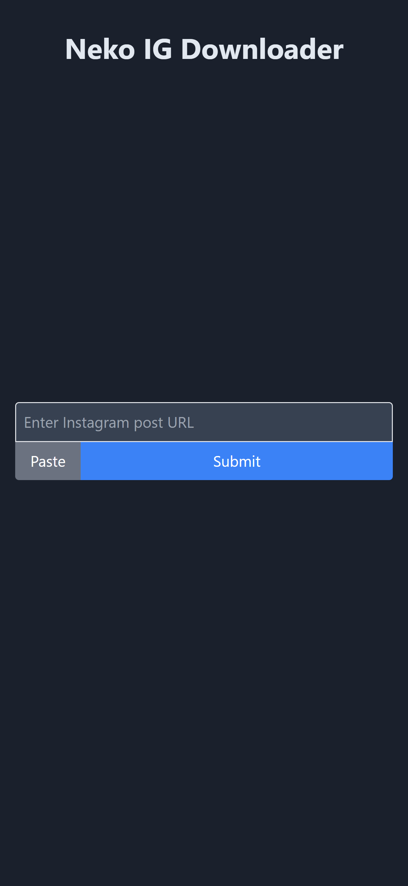
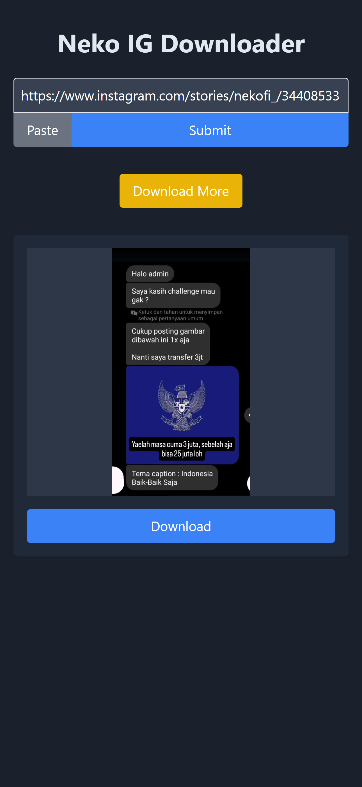

## Neko Instagram Downloader

A simple Instagram post downloader web app built with FastAPI, Tailwind CSS, and gallery-dl.

\



### Features

- Download Instagram posts (photos and videos) by providing the post URL.
- User-friendly interface with a clean and responsive design.
- Automatic file renaming for easy organization.
- Secure file handling with temporary storage and scheduled deletion.
- Built-in rate limiting to prevent abuse.

### Requirements

- Python 3.7+
- `gallery-dl`
- `fastapi`
- `uvicorn`
- `python-multipart`
- `jinja2`
- `pydantic`
- `slowapi`
- **Get Cookies.txt Locally (Chrome Extension):** You can download it from [https://chrome.google.com/webstore/detail/cclelndahbckbenkjhflpdbgdldlbecc](https://chrome.google.com/webstore/detail/cclelndahbckbenkjhflpdbgdldlbecc)

### Installation

1. Clone the repository:

   ```
   git clone https://github.com/arielfikru/nekoinsta.git
   cd nekoinsta
   ```

2. Create and activate a virtual environment (recommended):

   ```
   python3 -m venv venv
   source venv/bin/activate
   ```

3. Install the dependencies:

   ```
   pip install -r requirements.txt
   ```

4. Set up `gallery-dl`:

   - Make sure you have `gallery-dl` installed globally or in your virtual environment.
   - **Important: Instagram Cookies**
       1. Install the "Get Cookies.txt Locally" Chrome extension using the link above.
       2.  Go to Instagram.com and log in to your account.
       3. Click on the extension icon and click "Export" to download your cookies as `cookies.txt`.
       4. **Rename `cookies.txt` to `instagram.txt`** and place it in the same directory as your `main.py` file. 

5. Run the app:

   ```
   uvicorn main:app --reload
   ```

6. Access the app in your web browser at `http://127.0.0.1:8000/`.

### Usage

1. Enter the URL of the Instagram post you want to download.
2. Click the "Submit" button.
3. The downloaded files will be displayed on the page.
4. Click the "Download" button below each file to save it to your device.

### Notes

- The app uses a rate limiter to prevent abuse. You can adjust the limit in the `main.py` file.
- Downloaded files are temporarily stored in the `download` directory and are automatically deleted after a certain period (default: 10 minutes). You can adjust the deletion delay in the `main.py` file.

### Disclaimer

This app is for educational purposes only. Downloading copyrighted content may be illegal in your jurisdiction. Use at your own risk. 
